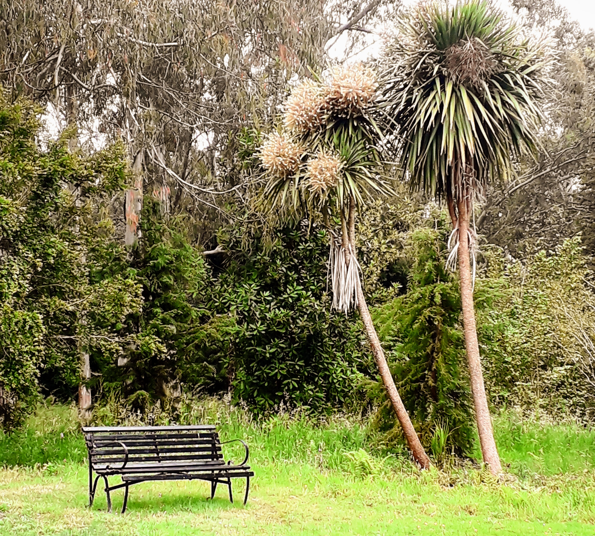

<h1>Bench Review #1</h1>

"What is this life if, full of care,
We have no time to stand and stare."

Or rather to sit down and let the world go by

The bench above is in Plas Newydd on Ynys Môn (Or Anglesey if you are English), and it is one of many benches that we will "review" on this site. 
What is a "Bench review" I hear you ask? 

Well, its a bit of harmless fun really. 
My wife and I regulasrly take walks around parks and visits to towns across the UK, and occassionaly we have a need to stop and rest from the sight-seeing/shopping/anbling around.

We started to notice that we were making decisions on where to sit based on a rather arbitrary set of preferences, and, on out weekly visit to our local park we started to play a game to see which of the many benches was our preferred spot.

<a href="https://w3w.co/language.ratty.shark">what3Words</a>

